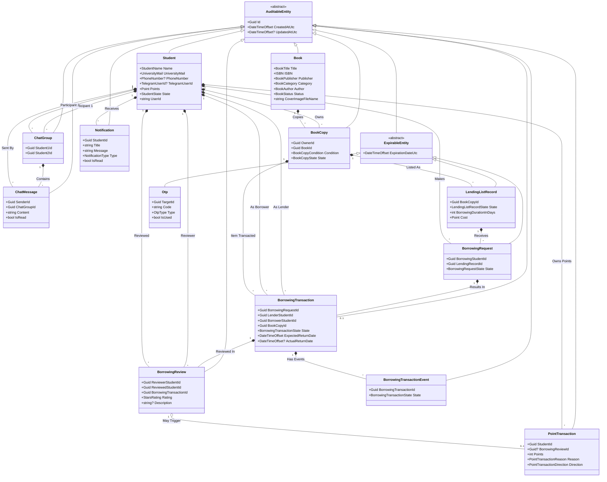

# BookOrbit Domain Class Diagram

This diagram visualizes the primary Domain Entities, their key attributes, and the relationships between them in the `BookOrbit.Domain` layer.

```mermaid
classDiagram
    %% Abstract Entities
    class AuditableEntity {
        <<abstract>>
        +Guid Id
        +DateTimeOffset CreatedAtUtc
        +DateTimeOffset? UpdatedAtUtc
    }

    class ExpirableEntity {
        <<abstract>>
        +DateTimeOffset ExpirationDateUtc
    }

    %% Inheritance
    AuditableEntity <|-- Student
    AuditableEntity <|-- Book
    AuditableEntity <|-- BookCopy
    AuditableEntity <|-- BorrowingTransaction
    AuditableEntity <|-- BorrowingReview
    AuditableEntity <|-- ChatGroup
    AuditableEntity <|-- ChatMessage
    AuditableEntity <|-- Notification
    AuditableEntity <|-- PointTransaction
    AuditableEntity <|-- BorrowingTransactionEvent
    
    ExpirableEntity <|-- LendingListRecord
    ExpirableEntity <|-- BorrowingRequest
    ExpirableEntity <|-- Otp
    
    AuditableEntity <|-- ExpirableEntity

    %% Core Domain Entities
    class Student {
        +StudentName Name
        +UniversityMail UniversityMail
        +PhoneNumber? PhoneNumber
        +TelegramUserId? TelegramUserId
        +Point Points
        +StudentState State
        +string UserId
    }

    class Book {
        +BookTitle Title
        +ISBN ISBN
        +BookPublisher Publisher
        +BookCategory Category
        +BookAuthor Author
        +BookStatus Status
        +string CoverImageFileName
    }

    class BookCopy {
        +Guid OwnerId
        +Guid BookId
        +BookCopyCondition Condition
        +BookCopyState State
    }

    class LendingListRecord {
        +Guid BookCopyId
        +LendingListRecordState State
        +int BorrowingDurationInDays
        +Point Cost
    }

    class BorrowingRequest {
        +Guid BorrowingStudentId
        +Guid LendingRecordId
        +BorrowingRequestState State
    }

    class BorrowingTransaction {
        +Guid BorrowingRequestId
        +Guid LenderStudentId
        +Guid BorrowerStudentId
        +Guid BookCopyId
        +BorrowingTransactionState State
        +DateTimeOffset ExpectedReturnDate
        +DateTimeOffset? ActualReturnDate
    }

    class BorrowingReview {
        +Guid ReviewerStudentId
        +Guid ReviewedStudentId
        +Guid BorrowingTransactionId
        +StarsRating Rating
        +string? Description
    }

    class ChatGroup {
        +Guid Student1Id
        +Guid Student2Id
    }

    class ChatMessage {
        +Guid SenderId
        +Guid ChatGroupId
        +string Content
        +bool IsRead
    }

    class PointTransaction {
        +Guid StudentId
        +Guid? BorrowingReviewId
        +int Points
        +PointTransactionReason Reason
        +PointTransactionDirection Direction
    }

    class Notification {
        +Guid StudentId
        +string Title
        +string Message
        +NotificationType Type
        +bool IsRead
    }

    class Otp {
        +Guid TargetId
        +string Code
        +OtpType Type
        +bool IsUsed
    }

    class BorrowingTransactionEvent {
        +Guid BorrowingTransactionId
        +BorrowingTransactionState State
    }

    %% Relationships
    Student "1" *-- "*" BookCopy : Owns
    Book "1" *-- "*" BookCopy : Copies
    
    BookCopy "1" *-- "*" LendingListRecord : Listed As
    
    LendingListRecord "1" *-- "*" BorrowingRequest : Receives
    Student "1" *-- "*" BorrowingRequest : Makes
    
    BorrowingRequest "1" *-- "0..1" BorrowingTransaction : Results In
    Student "1" *-- "*" BorrowingTransaction : As Lender
    Student "1" *-- "*" BorrowingTransaction : As Borrower
    BookCopy "1" *-- "*" BorrowingTransaction : Item Transacted
    
    BorrowingTransaction "1" *-- "*" BorrowingTransactionEvent : Has Events
    BorrowingTransaction "1" *-- "*" BorrowingReview : Reviewed In
    Student "1" *-- "*" BorrowingReview : Reviewer
    Student "1" *-- "*" BorrowingReview : Reviewed
    
    Student "1" *-- "*" PointTransaction : Owns Points
    BorrowingReview "1" o-- "0..1" PointTransaction : May Trigger
    
    Student "1" *-- "*" ChatGroup : Participant 1
    Student "1" *-- "*" ChatGroup : Participant 2
    ChatGroup "1" *-- "*" ChatMessage : Contains
    Student "1" *-- "*" ChatMessage : Sent By
    
    Student "1" *-- "*" Notification : Receives
```
